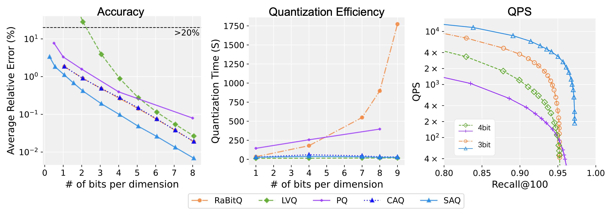

# Segmented Code Adjustment Quantization (SAQ)


> The fastest and most accurate quantization method for high-dimensional vectors.

Our project introduces **Segmented CAQ** (**SAQ**), a novel quantization algorithm built upon dimension balancing techniques and dimension reduction techniques. This advancement enables compression of high-dimensional vectors at arbitrary compression rates while maintaining quantization and estimation simplicity identical to classical scalar quantization. Notably, Segmented CAQ (SAQ) delivers superior accuracy at equivalent compression rates and efficient quantization process (80x faster than RaBitQ).

Here are some results of SAQ on the Msmarco dataset with 1024 dimensions and 10 million vectors.  

## Preparing

### Prerequisites
* AVX512 is required
* Install dependencies:
```Bash
apt install libfmt-dev libgoogle-glog-dev libgflags-dev libgtest-dev
```

### Compiling
```Bash
mkdir build bin
cd ./build
cmake ..
make
```
Source codes are stored in `./src`, binary files are stored in `./bin`.

### Datasets
Download and preprocess the datasets. Detailed instructions can be found in `./data/README.md`.
Please build the IVF index and PCA matrix before running SAQ.

## Running

### Unit Test

The unit test of SAQ and CAQ can be found in the `./unit_test` directory. You can run the tests using `ctest` in `./build/` or directly execute the test binaries `./bin/unit_tests`.

### Creating index
```Base
./bin/create_index -dataset gist -B 4     # SAQ
./bin/create_index -dataset gist -B 4 -enable_segmentation=false     #for CAQ only
```
* `-dataset gist` for the name of dataset
* `-B 4` for average number of bits used in SAQ per dimension, which can be a float number (e.g., 0.5, 1.5, 4, 8).
* `-enable_segmentation=false` to disable segmentation, that is, CAQ only.

The quantized index are stored in `./data/gist/`.

### Test quantization accuracy
```Base
./bin/test_relative_error -dataset gist -B 4    # SAQ
./bin/test_relative_error -dataset gist -B 4 -enable_segmentation=false     #for CAQ only
```
* The result files are stored in `./results/saq/`
* Raw datasets are required to compute quantization error.

### Test query performance
```Base
./bin/test_qps -dataset gist -B 4 # SAQ
./bin/test_qps -dataset gist -B 4 -enable_segmentation=false  #for CAQ only
```
* The result files are stored in `./results/saq/`
* Note: currently in the test code, we compute the average distance ratio so the raw datasets are loaded in memory.

For more arguments, please refer to `./bin/create_index --help`.